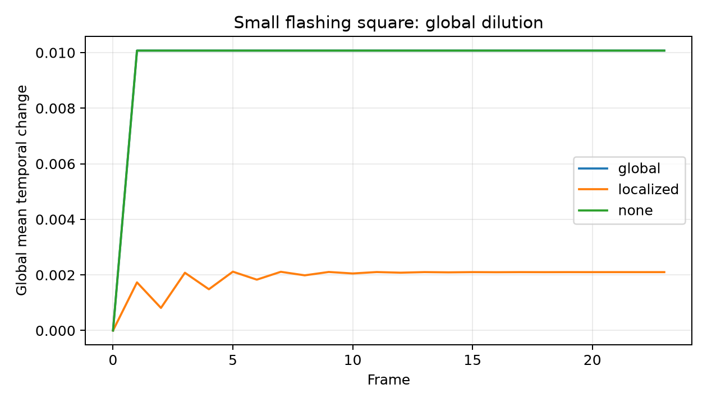
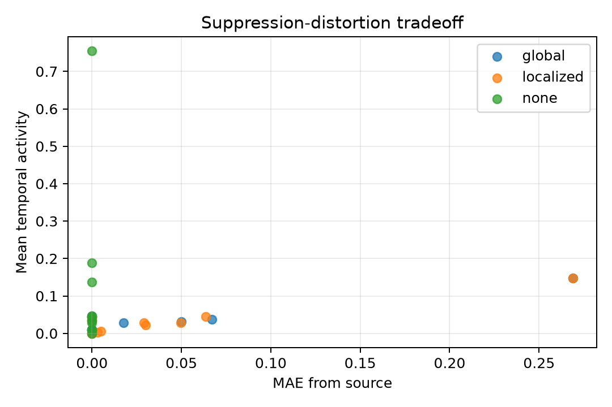
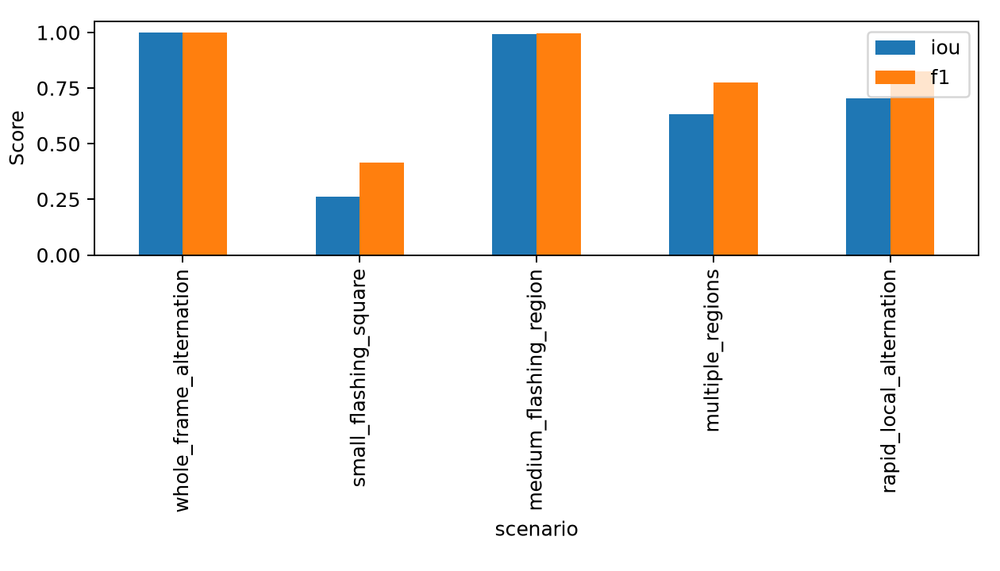

# Spatiotemporal Flash Filtering

> **Research question:** Can spatially localized temporal filtering reduce rapid luminance changes in video while preserving more of the original visual information than whole-frame filtering?

This repository is an undergraduate-oriented computer-vision research project for detecting rapid brightness changes and suppressing them only where they occur. It provides a readable NumPy/OpenCV implementation, deterministic synthetic data, baselines, quantitative evaluation, ablations, plots, tests, a CLI, and a [technical report](paper/main.tex).

> **Safety scope:** The measured temporal-activity quantities are computational proxies. This software has not been clinically validated, does not determine whether content is medically safe, does not prevent seizures, and does not establish WCAG or broadcast compliance.

## Method

Frames are decoded as gamma-encoded sRGB values in `[0,1]`. The default scalar representation first linearizes sRGB,

```text
C_linear = C_srgb / 12.92                         if C_srgb <= 0.04045
           ((C_srgb + 0.055) / 1.055)^2.4         otherwise,
```

then computes relative luminance `Y = 0.2126 R + 0.7152 G + 0.0722 B`. A separately named gamma-encoded luma proxy is available for experiments.

For consecutive frames, the per-pixel and global activity proxies are

```text
Delta_t(x,y) = |Y_t(x,y) - Y_(t-1)(x,y)|
D_t = mean_(x,y) Delta_t(x,y).
```

`D_t` is the global baseline detector. Its limitation is dilution: if 25% of pixels change by 0.8, `D_t = 0.2`; an intense but small region can fall below a global threshold. The localized detector instead averages recent difference maps, partitions the image into fixed blocks, thresholds each block mean, optionally closes small mask gaps, and Gaussian-feathers the result. It returns `M_t(x,y) in [0,1]`.

The global and localized baselines use one interpretable operation—temporal blending toward the previous filtered frame. The localized output is

```text
I_hat_t = (1 - alpha M_t) I_t + alpha M_t I_hat_(t-1).
```

This instantiates the conceptual objective `min D(V,V_hat)` subject to `R(V_hat) <= tau`: source distortion `D` and proxy activity `R` are reported jointly rather than collapsed into an unsupported safety score.

An experimental `enhanced` method adds opposing-transition detection,
multi-scale blocks, histogram-based cut rejection, and chromaticity-preserving
luminance-step clamping. Its research rationale, measured tradeoffs, and next
experiments are documented in [the research review](docs/research_review.md).
The planned production path separates low-cost analysis from full-resolution
rendering; see the [resolution-preservation design](docs/resolution_preservation.md).
The `framegen` method is an experimental one-frame-lookahead reconstruction
baseline. It is effective for isolated A-B-A excursions but is not recommended
for sustained alternation; its negative result is documented in the research
review rather than hidden.

The standards-inspired `multianalyzer` candidate keeps three evidence channels
separate: paired opposing luminance transitions at the same pixels, a documented
saturated-red proxy, and persistent regular stripe patterns. Only qualifying
temporal flash masks drive filtering; static pattern evidence is reported but
is not incorrectly "fixed" with temporal blending. This is a research proxy,
not a complete implementation or certification of WCAG, ITU-R, or ISO rules.

The `adaptive` candidate uses those channels to choose a localized correction
instead of applying one effect indiscriminately: saturated-red events are
desaturated with a soft spatial mask, general luminance events receive a
relative-linear-luminance step limit, and regular high-contrast pattern tiles
receive local contrast reduction. Grayscale therefore addresses chromatic
evidence only; it does not remove black-white flicker. The controls are
experimental parameters and do not establish clinical safety.

### Pipeline

```text
video -> RGB decoding -> luminance / red / pattern analyzers
      -> timestamp tracking + spatial overlap -> localized temporal blend
      -> activity + distortion + localization + runtime metrics -> CSV + plots
```

The implementation is `O(THW)` in time. Ordinary MP4 analysis and filtering
use constant-size temporal state and `O(HW)` frame memory; lossless NPZ
experiments intentionally load arrays for convenient evaluation. Main
hyperparameters are activity threshold, minimum area, block size, temporal
window, blend strength, cleanup kernel, and feathering sigma.

## Install and quick start

Python 3.11–3.14 is supported by the declared dependencies.

```bash
python3 -m venv .venv
source .venv/bin/activate
python -m pip install -e ".[dev]"
python -m pytest

flashfilter generate-synthetic
flashfilter analyze experiments/generated/small_flashing_square.npz
flashfilter filter experiments/generated/small_flashing_square.npz \
  --method localized --output outputs/small_filtered.mp4
flashfilter filter input.mp4 --method enhanced --threshold 0.04 \
  --output outputs/enhanced.mp4
flashfilter filter input.mp4 --method framegen --threshold 0.04 \
  --output outputs/framegen.mp4
flashfilter inspect input.mp4
flashfilter filter input.mp4 --method multianalyzer --threshold 0.10 \
  --output outputs/multianalyzer.mp4
flashfilter filter input.mp4 --method adaptive --threshold 0.10 \
  --desaturation 0.9 --max-luminance-step 0.08 \
  --pattern-contrast-reduction 0.35 --output outputs/adaptive.mp4
flashfilter benchmark
flashfilter benchmark-analyzers
flashfilter ablate
```

Ordinary video files are analyzed and filtered frame-by-frame in constant
memory, so longer media does not need to fit entirely in RAM. OpenCV writes
the filtered video stream only; if audio is required, remux the source audio
with FFmpeg after filtering.

Use `flashfilter <command> --help` for threshold, block, window, and mask controls. NPZ files provide lossless experiment I/O; MP4 output is intended for viewing.

### Public Python API

Applications should use the stable package-level API rather than importing
internal processing modules:

```python
from flashfilter import AdaptiveFilterConfig, analyze_video, filter_video

before = analyze_video("input.mp4")
result = filter_video(
    "input.mp4",
    "outputs/adaptive.mp4",
    method="adaptive",
    adaptive_config=AdaptiveFilterConfig(max_luminance_step=0.05),
)
print(result.to_dict())
```

Reports include resolution and frame-rate checks and always expose
`medical_safety_claimed = false`. OpenCV filtering does not copy audio; the
current research workflow remuxes source audio explicitly with FFmpeg.

`inspect` reports luminance-flash, red-flash, and regular-pattern evidence
separately and always includes `"standards_compliance_claimed": false`.
`benchmark-analyzers` writes deterministic channel-level results to
`experiments/results/analyzers/`. These labels test our documented proxies;
they do not establish medical safety or formal standards conformance.

Downloaded media and rendered videos remain under ignored `outputs/` paths.
[`experiments/media_manifest.json`](experiments/media_manifest.json) records
source identity, selection rationale, and hashes without redistributing source
videos. Planned research milestones are tracked in [`ROADMAP.md`](ROADMAP.md).

## Synthetic benchmark

The generator uses seed 7 and creates ten 24-frame, 96x64 scenarios: whole-frame alternation, small and medium flashing regions, independent regions, static texture, a gradual transition, a scene cut, global exposure-like variation, a moving bright object, and rapid localized alternation. Target scenarios include pixel masks. Negatives and confounds intentionally probe false detections.

All methods receive identical input. Reported metrics are mean/peak temporal activity, frames over the experimental threshold, high-change area, residual activity in labeled regions, MAE, MSE, PSNR, SSIM, modified-pixel ratio, mask precision/recall/F1/IoU, elapsed time, and FPS. The threshold `0.12` is an experimental normalized value—not a medical or standards threshold.

## Reproduced results

These values come from [`experiments/results/canonical/benchmark.csv`](experiments/results/canonical/benchmark.csv), generated on 2026-09-29. They are means over ten synthetic scenarios. Runtime is machine-dependent.

| Method | Mean activity | Peak activity | MAE | SSIM | Modified area | Residual in labeled regions |
|---|---:|---:|---:|---:|---:|---:|
| None | 0.1251 | 0.2007 | 0.0000 | 1.0000 | 0.0000 | 0.5000* |
| Global | 0.0385 | 0.1069 | 0.0403 | 0.9545 | 0.1386 | 0.2613* |
| Localized | 0.0356 | 0.0836 | 0.0449 | 0.9385 | 0.1562 | 0.1325* |

`*` The aggregate includes unlabeled negative/confound cases, for which residual-in-region is defined as zero. Use per-scenario rows for interpretation.

The localized method modified only `0.0100` of pixel locations for the small-square scenario (IoU `0.2623` because an 8x8 block is coarser than the target), but `0.9583` for whole-frame alternation. Thus localization can preserve unaffected area on small targets; it provides no area advantage when the entire image changes. In this configuration it achieved lower mean activity but slightly worse MAE/SSIM than the global baseline, so it does not dominate on every objective.







## Ablations and limitations

[`ablation_summary.csv`](experiments/results/canonical/ablation_summary.csv) shows the expected tradeoffs rather than a universal winner. A 4-pixel block improved mean IoU from `0.6589` (default) to `0.7511` with similar activity; a hard mask lowered activity slightly but increased distortion and risks visible seams. Cleanup made no measurable difference on these clean synthetic shapes, which is itself informative.

Important failure cases:

- A scene cut caused 8.33% of pixel locations to be modified and has zero localization IoU against the no-flash ground truth.
- A moving bright object caused 2.11% modification and zero IoU. Frame differencing conflates motion boundaries with brightness alternation.
- Global exposure oscillation was not filtered at the default local threshold, leaving mean activity `0.0436`.
- The canonical filtering benchmark is small, synthetic, SDR, and uncompressed internally. A separate research analyzer now covers a simple saturated-red proxy and regular stripes, but it does not implement normative color definitions, viewing geometry, display brightness, HDR transfer functions, diagonal/curved patterns, or human outcomes.
- PSNR/SSIM reward the no-op method, so they must be interpreted with activity reduction. Runtime figures are wall-clock measurements, not controlled hardware benchmarks.

Alternatives worth studying include connected components, motion compensation, bidirectional/offline smoothing, frequency-domain temporal features, adaptive blocks, perceptual masking, and standards-specific analyzers. Each adds complexity that should be justified experimentally.

## Repository structure and reproducibility

```text
src/flashfilter/       algorithms, metrics, I/O, CLI, plots
experiments/           generation and experiment entry points
experiments/results/   canonical CSV/JSON outputs and figures
tests/                 analytic and end-to-end tests
paper/                 LaTeX report and bibliography
examples/              user-facing examples
```

To reproduce from a fresh clone, follow the install block, then run `python -m pytest`, `flashfilter generate-synthetic`, `flashfilter benchmark`, `flashfilter benchmark-analyzers`, and `flashfilter ablate`. The seed and complete canonical configuration are saved in `config.json`. Generated videos are ignored; the small canonical tables and figures are versioned deliberately.

## Future work

Evaluate real annotated video, add motion/scene-cut rejection, estimate temporal frequency rather than only frame differences, calibrate parameters on a separate validation split, support streaming and HDR metadata, and compare against independently implemented published or standards-based analyzers without conflating proxy improvement with medical safety.
