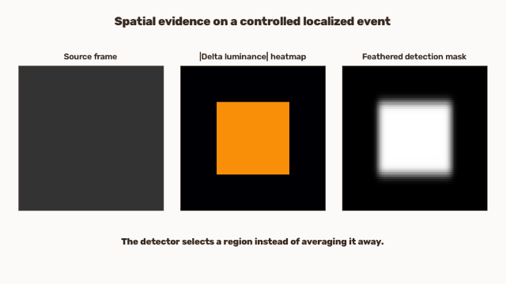
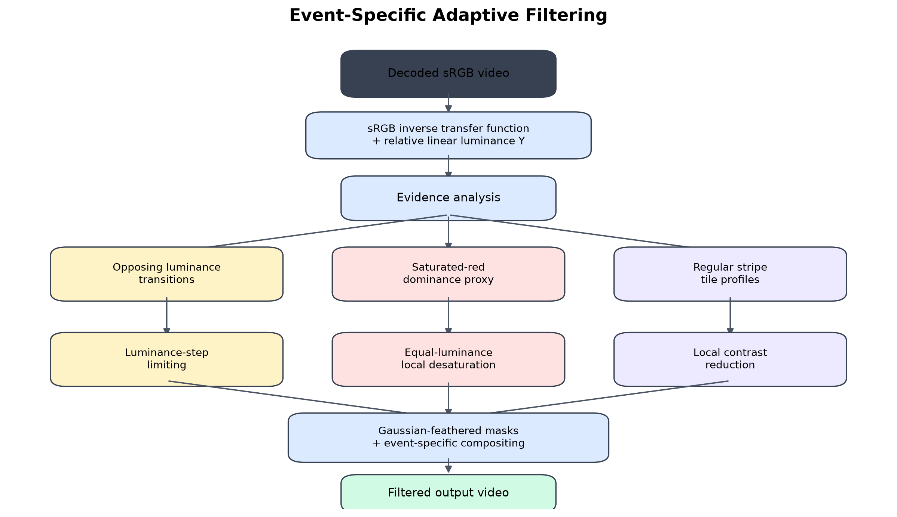
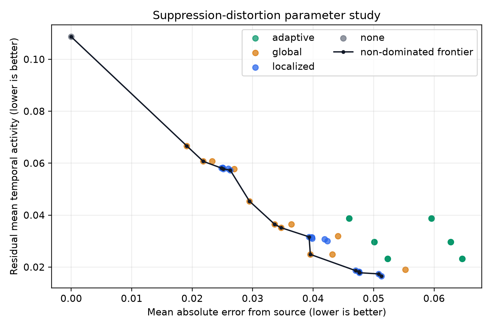
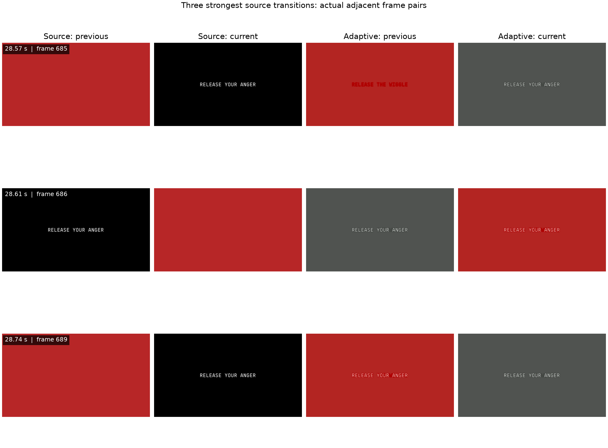

# Spatiotemporal Flash Filtering

**Research question:** Can spatially localized temporal filtering reduce rapid visual changes while preserving more source information than whole-frame filtering?



[📄 Technical report](paper/main.pdf) · [LaTeX source](paper/main.tex) · [Method notes](docs/METHOD_NOTES.md) · [Full 40-second demo](docs/assets/demo.mp4)

> **Research scope:** This is an undergraduate computer-vision research prototype. Its temporal-activity measurements are computational proxies—not clinical seizure-risk estimates. It has not been clinically validated and does not guarantee medical safety, WCAG conformance, or broadcast compliance.

## What the project does

The package converts decoded sRGB frames to relative linear luminance, measures frame-to-frame changes, localizes rapid changes, and applies a correction only where evidence is detected. The central comparison is:

- **Baselines:** no filtering, whole-frame temporal blending, and localized block-based blending.
- **Proposed experimental method:** event-specific adaptive filtering with separate luminance, saturated-red, and regular-pattern evidence channels.
- **Exploratory studies:** enhanced and frame-reconstruction filters retained for failure analysis, not presented as central methods.



For normalized frames, the principal signal is

```text
Delta_t(x,y) = |Y_t(x,y) - Y_(t-1)(x,y)|
D_t = mean_(x,y) Delta_t(x,y)
```

where `Y` is computed after sRGB transfer-function inversion using the linear-light coefficients `0.2126, 0.7152, 0.0722`. The localized baseline thresholds block means of recent `Delta` maps and feathers the resulting mask. The adaptive method instead maps luminance reversals to step limiting, red-transition evidence to equal-luminance desaturation, and regular stripe-like patterns to local contrast reduction.

## Main result: suppression and distortion must be read together

The v1.0 experiment contains **12 deterministic synthetic scenarios**, **49 operating points**, and **588 per-case sweep measurements**. Lower is better on both axes.



The negative result is important: **none of the evaluated adaptive configurations lies on the aggregate MAE/activity Pareto frontier**. Tuned global and localized baselines provide better tradeoffs on these two objectives. The adaptive method still provides the best default aggregate mask IoU and useful event-specific behavior, but at greater distortion and with first-transition latency.

Default-setting means from the generated [canonical CSV](experiments/results/canonical/summary.csv):

| Method | Mean activity ↓ | Peak ↓ | MAE ↓ | SSIM ↑ | Modified area ↓ | IoU ↑ |
|---|---:|---:|---:|---:|---:|---:|
| None | 0.1087 | 0.1717 | 0.0000 | 1.000 | 0.000 | 0.417 |
| Global baseline | 0.0365 | 0.0935 | 0.0336 | 0.962 | 0.115 | 0.451 |
| Localized baseline | 0.0310 | 0.0741 | 0.0399 | 0.940 | 0.149 | 0.628 |
| Event-specific adaptive | 0.0297 | 0.1674 | 0.0562 | 0.917 | 0.165 | 0.891 |

The adaptive ablation shows that the luminance branch supplies nearly all aggregate temporal suppression. Red correction gives a small benefit on the designed red case; pattern correction changes static appearance without reducing temporal activity. These mixed results are preserved in the report rather than hidden.

## Why localization matters

On the small-square case, the global default does nothing because spatial averaging dilutes the event. Localized filtering reduces mean activity from `0.01007` to `0.00198` while modifying about `1.0%` of pixel locations. For whole-frame alternation, localization offers no area advantage and produces the same output as global filtering. The method is therefore useful in a specific spatial regime, not universally superior.

The synthetic suite also keeps difficult confounds: scene cuts, moving objects, gradual illumination, and global exposure changes. See the generated [failure-case figure](paper/figures/failure_cases.png) and the per-case rows in [benchmark.csv](experiments/results/canonical/benchmark.csv).

## Natural-media case study

A 47-second excerpt from an official lyric video is used as a natural-media demonstration, not as clinically labeled validation. Under a diagnostic-strength adaptive setting, mean activity decreases from `0.06293` to `0.01408`, but the filtered peak remains `0.11285` and visible black-to-gray alteration occurs. Source media is not committed; [media_manifest.json](experiments/media_manifest.json) records provenance, segment metadata, rationale, and hashes.



## Install and try it

Python 3.11–3.13 is tested in CI.

```bash
python3 -m venv .venv
source .venv/bin/activate
python -m pip install -e ".[dev]"
python -m pytest

flashfilter generate-synthetic
flashfilter analyze experiments/generated/small_flashing_square.npz
flashfilter filter experiments/generated/small_flashing_square.npz \
  --method localized --output outputs/small_filtered.mp4
flashfilter filter input.mp4 --method adaptive --output outputs/adaptive.mp4
```

Use `flashfilter <command> --help` for thresholds, block size, temporal window, blend, correction strengths, and mask feathering. NPZ is used for lossless experiments; ordinary video files are processed frame-by-frame. OpenCV video output does not preserve audio, so audio remuxing remains an explicit post-processing step.

## Reproduce the research

Run every synthetic v1.0 experiment with one command:

```bash
./scripts/reproduce.sh
```

Equivalent individual commands are:

```bash
flashfilter generate-synthetic --seed 7
flashfilter benchmark --output-dir experiments/results/canonical --seed 7
flashfilter benchmark-analyzers --output-dir experiments/results/canonical/analyzers
flashfilter ablate --output-dir experiments/results/canonical/localized_ablation --seed 7
flashfilter sweep --output-dir experiments/results/canonical/sweep --seed 7
flashfilter ablate-adaptive --output-dir experiments/results/canonical/adaptive_ablation --seed 7
python experiments/generate_v1_figures.py
python paper/build_pdf.py
```

The seed, grid, objectives, and generated outputs are stored beside the CSV files. Fast tests run on pushes and pull requests; a separate manual GitHub Actions workflow runs the full synthetic reproduction. No copyrighted external media is required.

## Repository map

```text
src/flashfilter/             package, algorithms, metrics, streaming I/O, CLI
experiments/                 deterministic generators and experiment entry points
experiments/results/canonical/  versioned tables and plots used in the paper
tests/                       analytic, integration, determinism, and serialization tests
paper/                       LaTeX report, verified bibliography, and figures
docs/METHOD_NOTES.md         design choices, complexity, parameters, alternatives
docs/assets/                 reproducible demo GIF/MP4 and metadata
```

## Limitations

- Opposing-transition evidence cannot correct the first large transition.
- Frame differences confuse motion and cuts with intensity changes.
- Global events leave no unaffected region for localization to preserve.
- Recursive blending can ghost motion; reconstruction can create interpolation artifacts.
- The pattern detector covers horizontal/vertical tile profiles, not arbitrary geometry.
- The red signal is a documented ratio proxy, not a complete perceptual or normative model.
- The benchmark is small, synthetic, SDR, and not a clinical dataset.
- Display calibration, HDR, viewing geometry, physiology, and audio/timestamps are outside the current model.

The next defensible research steps are scene-cut rejection, motion compensation, local temporal-frequency estimation, improved chromatic modeling, broader annotated datasets, and held-out parameter selection. See [ROADMAP.md](ROADMAP.md).

## License

[MIT](LICENSE)
